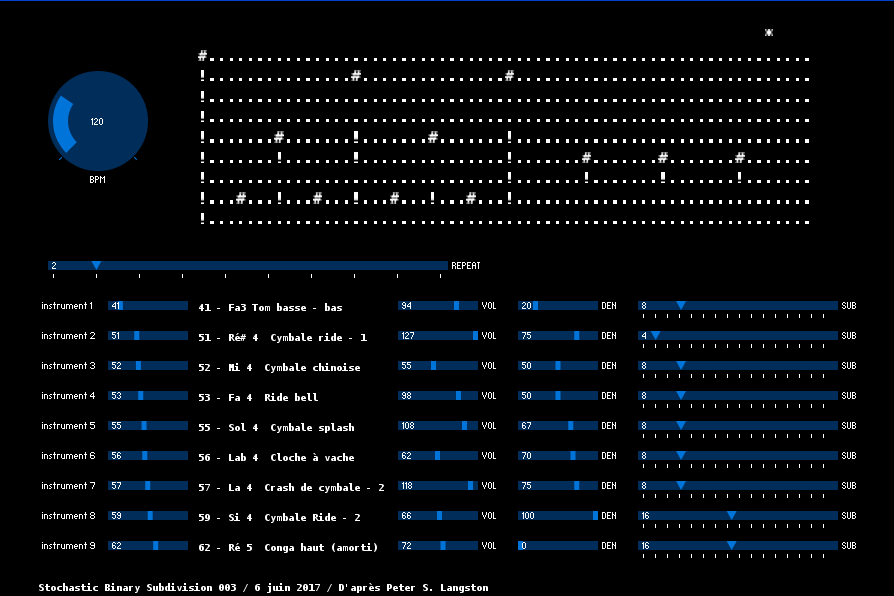
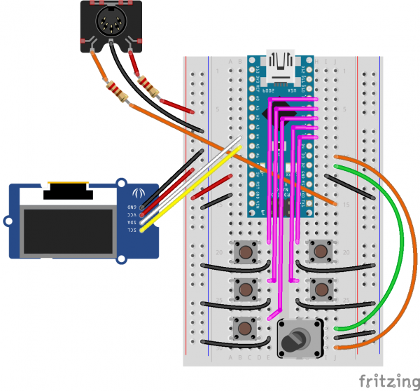
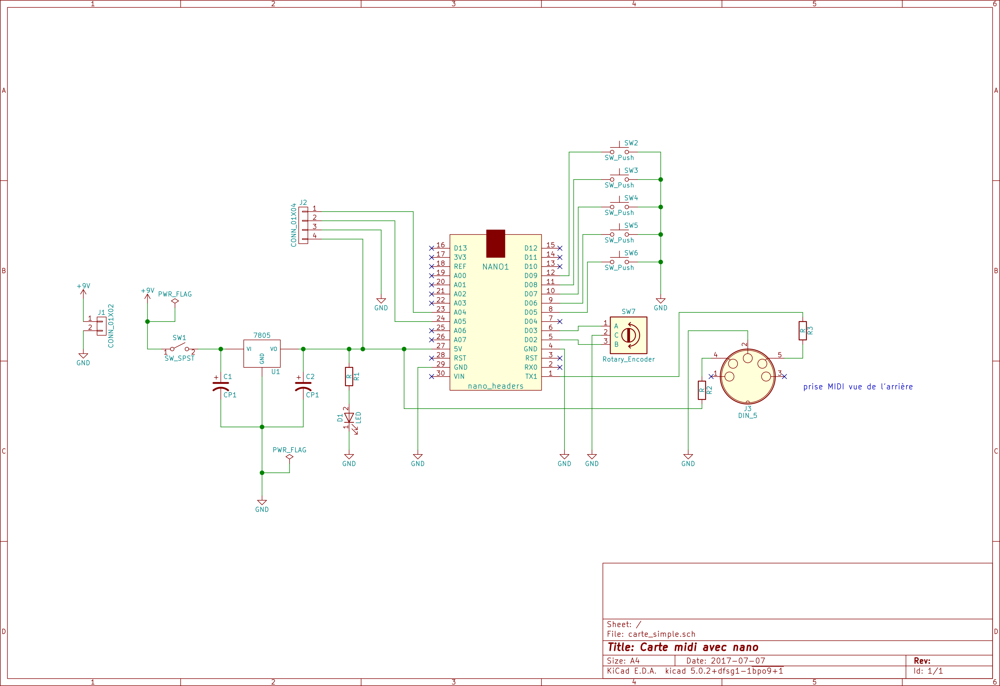
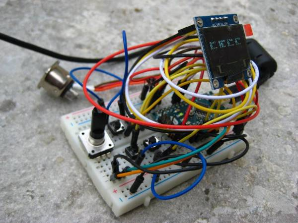

# binaringo

(Projet en cours / premier jet 11 juillet 2021)

Boîte à rythme algorithmique pour la création de motifs rythmiques MIDI. L'algorithme est de type «Stochastic binary subdivision» décrit par Peter S. Langston dans «[Six Techniques for Algorithmic Music Composition (1988)](http://peterlangston.com/Papers/amc.pdf)».

Il est implémenté dans un programme réalisé avec Processing pour tester mais surtout dans un circuit utilisant un arduino nano, un écran monochrome de petite taille, un encodeur rotatif et quelques boutons multifonctions. L'ensemble tient sur une plaque d'essai de petit format.  
On peut aussi se fabriquer un PCB (réalisé sur kicad), mais ce n'est pas tout à fait au point...

## Principe et utilisation

### Principe

TODO

### Comment s'en servir ?

Relier en MIDI à un expandeur ou un synthé.  
Par défaut, le canal MIDI 10 est utilisé, il est traditionnellement associé aux percussions, chaque note correspond à un son de percussion particulier. Mais il est aussi possible d'utiliser n'importe quel autre canal, et jouer les notes d'un instrument.  
Il se rallume avec le dernier preset sauvegardé

### Capacité

* 8 pistes
* 16 pas
* 24 presets enregistrables en EEPROM

#### Sur l'écran

4 vues différentes sont disponibles :

##### Paramètres
```
        SWG FIX
        50  OFF
PAS BPM PRE INS
12  140 15  0
BNK NOT DEN SUB
0   36  75  2
VOL     REP PLY
127     1   ON
```
* **SWG** : swing (entre 10 et 90)
* **FIX** : motif figé (on/off)
* **PAS** : pas (de 0 à 15)
* **BPM** : (Beats Per Minute) tempo (entre 20 et 255)
* **PRE** : (Preset) numéro du jeu de paramètres en mémoire (entre 0 et 23)
* **INS** : instrument sélectionné (entre 0 et 127)
* **BNK** : banque de son (dépendant de l'expandeur)
* **NOT** : valeur de la note MIDI envoyée (entre 0 et 127)
* **DEN** : densité en pourcentage (entre 0 et 100)
* **SUB** : subdivisions où une note peut être jouée (1, 2, 4, 8, 16)
* **VOL** : volume envoyé en MIDI (entre 0 et 127)
* **REP** : répétitions du motif (entre 1 et 255)
* **PLY** : (Play) envoi actif/inactif (on/off)

#### Séquence
```
o.......o.......
o...o...o...o...
o.......o.......
................
................
o.o.o...o.o.o.o.
o.o.o...o.o.o.o.
o...o.ooooooo...
```
Les o représentent les pas sur lesquels l'instrument joue. Dans une colonne, seul l'instrument le plus haut est joué.
#### Résumé
```
0  36 75  4  127
0  38 75  4  96
0  42 50  8  120
0  37 50  8  64
0  45 67  8  80
0  39 70  8  64
0  56 75  8  64
0  46 50  16 80
```
* banque
* instrument de percussion (sur le canal 10), ou note MIDI
* densité
* subdivision
* volume

#### Debug
TODO
```
MP PA GL IN VW
-- -- -- LN --
```

#### Utilisation des boutons

L'encodeur rotatif permet de changer les valeurs du paramètre sélectionné.

Chaque bouton réalise deux fonctions, selon qu'on appuie brièvement ou longuement

| Bouton        | Clic court                                      | Clic long                       |
| ------------- |:-----------------------------------------------:| -------------------------------:|
| PARAM         | changer de paramètres                           | fixer le pattern                |
| SET           | changer de preset                               | enregistrer le preset           |
| GLOB          | changer REPEAT, SWING, BPM                      | play ON/OFF                     |
| INST          | changer d'instrument                            | message MIDI "ALL NOTES OFF"    |
| VIEW          | changer de vue : PARAMS, RHYTHME, TOUT, DEBUG   | vue ON/OFF                      |

### MIDI

Pour chaque note, deux messages MIDI sont envoyés : NOTE ON et NOTE OFF

Pour adapter binaringo à un expandeur particulier (par exemple pour envoyer des commandes de changement de banque), il est nécessaire de modifier les valeurs dans le code.


## Prototypes

### Version logiciel

Deux programmes réalisés avec processing pour tester l'algorithme. La version 001 implémente l'algorithme, sans plus. La version 003 est fonctionnelle pour envoyer les commandes MIDI, sauvegarder les *presets* et les *patterns*.

*Screenshot* de la version 003



### Version circuit







Versions actuelles du code :
* **binaringo_009** : dernière version
* **binaringo 010** : version adaptée pour Yamaha QY70 (Note Off MIDI pour chaque note envoyée)

Historique des versions
* binaringo_004 : intéressant à conserver car utilise l'affichage u8g2
* binaringo_007 : version fonctionnelle
* binaringo_008 : version fonctionnelle, refonte avec nouvelles fonctions : swing, fixed on/off, plusieurs "views"
* binaringo_009 : version fonctionnelle débuguée
* binaringo_010 : version pour Yamaha QY70, qqes autres bugs corrigés

### Pour la suite
1 feature request : ajouter un signal MIDI clock pour interagir avec d'autres machines MIDI (ça risque de prendre un peu trop de temps sur un arduino nano/atmega328)  
Modifier la vue de pattern pour ne représenter que les instruments réellement joués.  
Permettre les modifications en vue résumée
